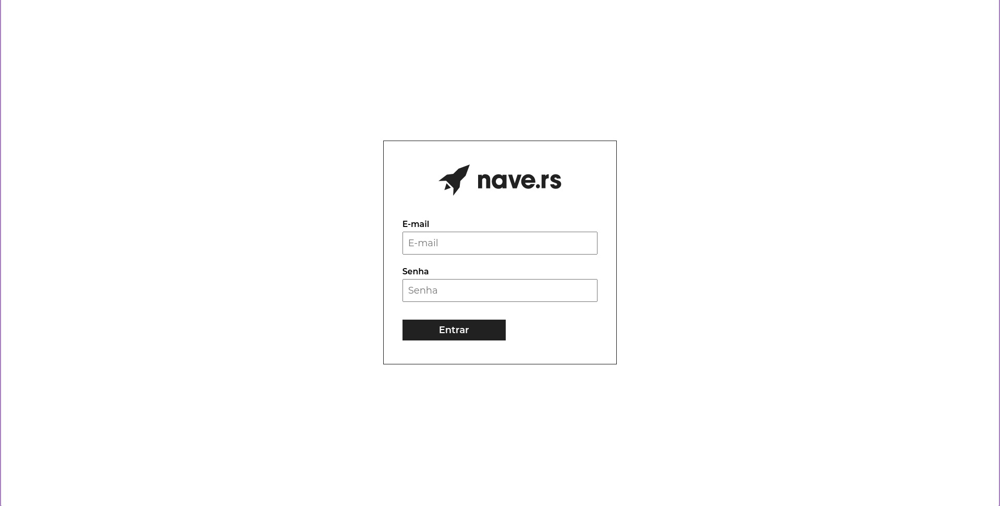
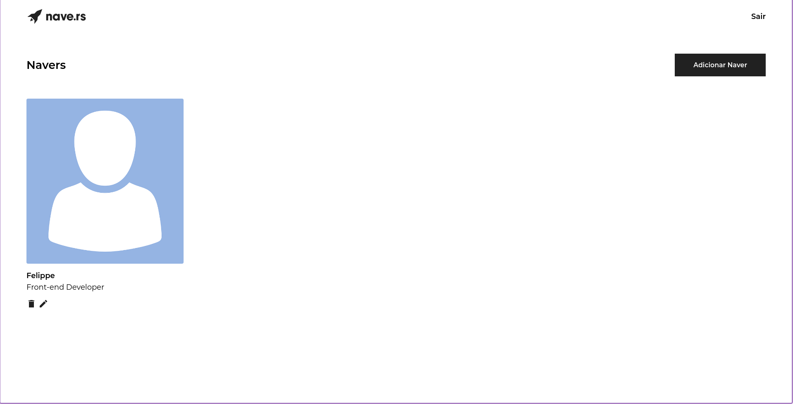
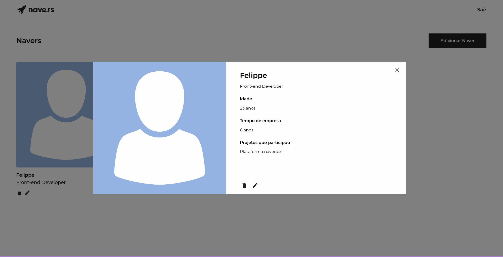
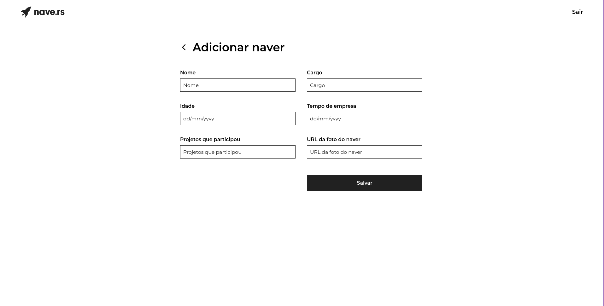

<h1 align="center">
    🚀  <a href="https://teste-nave.vercel.app/" alt="site nave"> Navedex </a>
</h1>

<p align="center">
  

  

  <a href="https://github.com/afpp3/teste-nave/commits/master">
    
  </a>

</p>

<h4 align="center">
	🚧   Concluído 🚀 🚧
</h4>

# Tabela de conteúdos

<!--ts-->

- [Sobre o projeto](#-sobre-o-projeto)
- [Funcionalidades](#-funcionalidades)
- [Layout](#-layout)
- [Preview](#-preview)
- [Como executar o projeto](#-como-executar-o-projeto)
  - [Pré-requisitos](#pré-requisitos)
  - [Rodando a aplicação web (Frontend)](#user-content--rodando-a-aplicação-web-frontend)
- [Tecnologias](#-tecnologias)
  - [WebSite](#user-content-website--react----typescript)
- [Autor](#-autor)
<!--te-->

## 💻 Sobre o projeto

O sistema consiste em uma web app para visualização e criação dos navers, possuindo informações como: nomes, idades, cargos, tempo de empresa e projetos que participou.

---

## ⚙️ Funcionalidades

- [x] Login na plataforma
- [x] Rotas autenticadas para acessar as funcionalidades da plataforma
- [x] Listagem dos navers ao fazer login
- [x] Visualização detalhada do naver selecionado
- [x] Cadastro de navers na plataforma
- [x] Edição de navers cadastrado
- [x] Exclusão de navers cadastrado

---

## 🎨 Layout

<br>

<p align="center" style="display: grid; grid-template-columns: 1fr 1fr; gap: 20">
  

  

</p>

<p align="center" style="display: grid; grid-template-columns: 1fr 1fr; gap: 20">
  

  

</p>

---

## 🔥 Preview

Use as seguintes informações para logar:

<p>
  email: testing-andre-felippe1@nave.rs
</p>

<p>
  password: nave1234
</p>

[](https://teste-nave.vercel.app/)

## 🚀 Como executar o projeto

### Pré-requisitos

Antes de começar, você vai precisar ter instalado em sua máquina as seguintes ferramentas:
[Git](https://git-scm.com), [Node.js](https://nodejs.org/en/).
Além disto é bom ter um editor para trabalhar com o código como [VSCode](https://code.visualstudio.com/)

#### 🧭 Rodando a aplicação web (Frontend)

```bash

# Clone este repositório
$ git clone git@github.com:afpp3/teste-nave.git

# Acesse a pasta do projeto no seu terminal/cmd
$ cd teste-nave

# Instale as dependências
$ yarn

# Execute a aplicação em modo de desenvolvimento
$ yarn start

# A aplicação será aberta na porta:3000 - acesse http://localhost:3000 no seu navegador

```

---

## 🛠 Tecnologias

As seguintes ferramentas foram usadas na construção do projeto:

#### **Website** ([React](https://reactjs.org/))

- **[React Router Dom](https://github.com/ReactTraining/react-router/tree/master/packages/react-router-dom)**
- **[Axios](https://github.com/axios/axios)**
- **[React Hook Form](https://react-hook-form.com/)**
- **[CSS Modules](https://github.com/css-modules/css-modules)**

## 🦸 Autor

 
 <br />
 <sub><b>André Felippe</b></sub></a> <a href="https://www.linkedin.com/in/andre-felippe/" title="Linkedin"></a>
 <br />

[](https://www.linkedin.com/in/andre-felippe/)
[](afelipp3@gmail.com)
